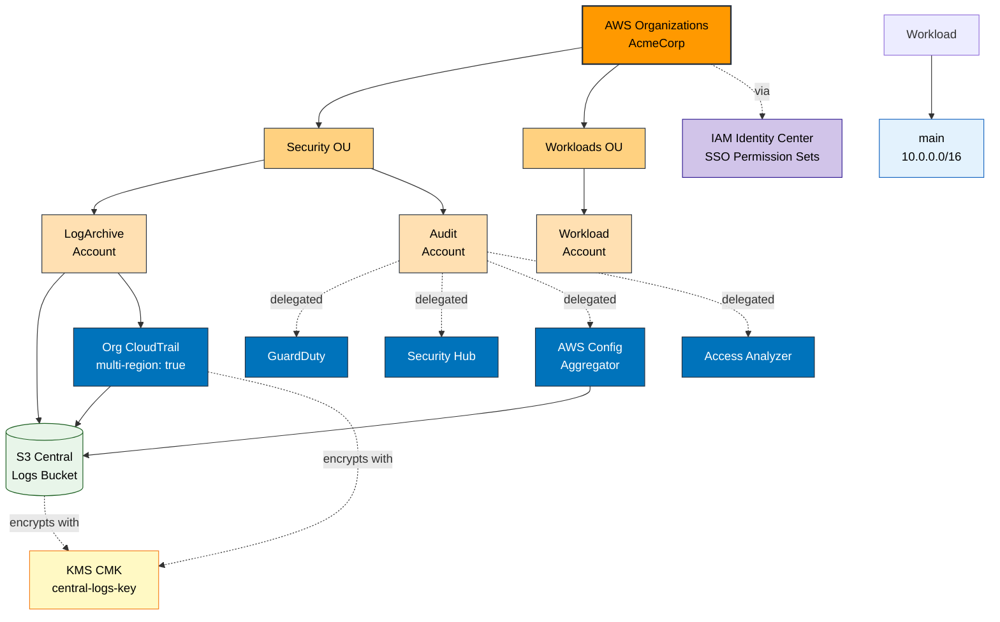

<!--
Generated by Merlin Studio (https://app.merlin-studio.cloud).
Licensed under the Apache License, Version 2.0 (https://www.apache.org/licenses/LICENSE-2.0).

AWS Landing Zone — README
Organization: AcmeCorp
Profile:      SIMPLE
Generated:    2026-06-17T09:00:13.913147Z
-->

# AWS Startup Landing Zone — Merlin Studio Example

A lean, CIS-aligned **AWS multi-account landing zone** for an early-stage startup
(fictional **AcmeCorp**), generated by [**Merlin Studio**](https://app.merlin-studio.cloud)
from a single intent spec and emitted in **two infrastructure-as-code formats**.

This repository is a **reference example** — it shows what Merlin produces for a
*simple* profile: the minimum viable governance baseline (org + security/log/audit
accounts, one workload account, CIS controls, GitHub Actions OIDC) without the
multi-region, PHI-isolation, or advanced-security weight a regulated zone carries.

> **Not a turnkey deployment.** Real AWS identifiers are stubbed as `PLACEHOLDER_*`
> tokens and all contact addresses use the reserved `example.com` domain. See
> [`PLACEHOLDERS.md`](./PLACEHOLDERS.md) before attempting to deploy.

---

## The scenario

| | |
|---|---|
| **Organization** | AcmeCorp (fictional startup) |
| **Profile** | simple (startup) |
| **Compliance** | CIS |
| **Home region** | us-east-2 (single region) |
| **CI/CD** | GitHub Actions — keyless OIDC deploy role scaffolded |
| **Accounts** | Management, LogArchive, Audit + one Workload account |
| **Security scorecard** | **100/100 (A+)** — 150 compliance checks + 138 Checkov checks, 0 failures |
| **Architecture scorecard** | **100/100 (A)** |

---

## Two formats, one spec

The same intent compiles to two independent deployment artifacts. Pick the one that
matches your stack:

| Format | Folder | What it is | Best for |
|---|---|---|---|
| **LZA** | [`aws-lza/`](./aws-lza) | AWS Control Tower + Landing Zone Accelerator (declarative YAML) | Teams standardizing on AWS-native governance |
| **Terraform tfvars** | [`aws-tfvars/`](./aws-tfvars) | Variable definitions (`*.auto.tfvars`) consumed by Terraform / OpenTofu landing-zone modules | Teams running their own Terraform / OpenTofu module stack |

Shared docs at the repository root:

- [`architecture.mmd`](./architecture.mmd) — Mermaid topology diagram (rendered below)
- [`ARCHITECTURE_SCORECARD.md`](./ARCHITECTURE_SCORECARD.md) / [`SECURITY_SCORECARD.md`](./SECURITY_SCORECARD.md)
- [`COMPLIANCE_UPGRADES.md`](./COMPLIANCE_UPGRADES.md) — every value a compliance framework forced
- [`DEPLOYMENT_GUIDE.md`](./DEPLOYMENT_GUIDE.md) — deploy-and-verify runbook per format

---

## What's in this repository

```
.
├── README.md                  (this file)
├── DEPLOYMENT_GUIDE.md        Step-by-step deploy for each format
├── architecture.mmd           Mermaid topology diagram
├── ARCHITECTURE_SCORECARD.md  Design-quality scorecard
├── SECURITY_SCORECARD.md      Compliance + Checkov scorecard
├── COMPLIANCE_UPGRADES.md     Compliance-driven changes
├── PLACEHOLDERS.md            Tokens to replace before deploy
├── aws-lza/                   Format 1: AWS Control Tower + Landing Zone Accelerator (YAML)
│   ├── global-config.yaml
│   ├── accounts-config.yaml
│   ├── organization-config.yaml
│   ├── iam-config.yaml
│   ├── network-config.yaml
│   ├── security-config.yaml
│   └── service-control-policies/, kms/, tag-policies/, ssm-documents/  (supporting JSON/YAML)
└── aws-tfvars/                Format 2: Terraform / OpenTofu variable definitions
    ├── accounts.auto.tfvars
    ├── organizations.auto.tfvars
    ├── iam.auto.tfvars
    ├── network.auto.tfvars
    ├── security.auto.tfvars
    ├── cloudtrail.auto.tfvars
    ├── kms.auto.tfvars
    └── backup.auto.tfvars
```

---

## Architecture



---

## Account inventory

### Mandatory accounts (LZA-required)

| Name | Purpose | OU |
|---|---|---|
| Management | AWS Organizations payer + LZA control plane | Root |
| LogArchive | Central log archive (CloudTrail org trail, Config) | Security |
| Audit | Security tooling delegated administrator | Security |

### Workload accounts
| Name | OU | Description |
|---|---|---|
| Workload | Workloads | Application account — VPCs and workload resources live here, never in Management. |

---

## Compliance posture

This zone is configured to meet **CIS** baseline requirements. Controls applied:

- CloudTrail organization trail with KMS-CMK encryption and log file validation
- AWS Config recorder + aggregator delegated to the Audit account
- GuardDuty with `auto_enable = true` for all org members
- Security Hub with framework-aligned standards subscriptions
- IAM password policy: min length 14, rotation every 90 days
- KMS CMKs with automatic key rotation enabled (CIS 3.8). The tfvars format sets a
  90-day rotation period (stricter than CIS requires); LZA uses AWS-managed annual rotation
- S3 default encryption + SSL-only bucket policies
- EBS default encryption and IMDSv2 required on all EC2 instances
- VPC Flow Logs on every VPC, all-traffic, with CloudWatch + S3 destinations

---

## Before you deploy

1. **Search and replace `PLACEHOLDER_` tokens** — account emails, AWS account IDs,
   and the org ID. See [`PLACEHOLDERS.md`](./PLACEHOLDERS.md).
2. **Pre-create your AWS Organization** with a Management account. LZA / Terraform
   cannot bootstrap the org itself.
3. **Enable AWS Organizations trusted service access** from the management account —
   or confirm AWS Control Tower already has — *before* deploying:
   ```bash
   aws organizations enable-aws-service-access --service-principal cloudtrail.amazonaws.com
   aws organizations enable-aws-service-access --service-principal config.amazonaws.com
   aws organizations enable-aws-service-access --service-principal controltower.amazonaws.com
   aws organizations enable-aws-service-access --service-principal guardduty.amazonaws.com
   aws organizations enable-aws-service-access --service-principal securityhub.amazonaws.com
   aws organizations enable-aws-service-access --service-principal sso.amazonaws.com
   ```
   And enable the organization policy types the zone uses:
   ```bash
   aws organizations enable-policy-type --root-id <ROOT_ID> --policy-type SERVICE_CONTROL_POLICY
   aws organizations enable-policy-type --root-id <ROOT_ID> --policy-type TAG_POLICY
   ```
   Skipping this breaks org-wide CloudTrail, the Config aggregator, GuardDuty /
   Security Hub org auto-enable, and IAM Identity Center.
4. **Enable AWS IAM Identity Center** in the management account if you want SSO
   permission sets to provision.
5. **Bootstrap state storage** for Terraform / OpenTofu (S3 + DynamoDB lock) if you
   deploy the `aws-tfvars` format — see [`DEPLOYMENT_GUIDE.md`](./DEPLOYMENT_GUIDE.md).

---

## How this Landing Zone was generated

Merlin Studio uses a **compile-AI** approach. LLMs run at **design time** to encode
AWS best-practice patterns, compliance-framework requirements, and discovery-driven
defaults into a static rules engine. At **generation time** every value is derived
**deterministically** from the discovery answers — **no LLM call happens during
generation**, so the same answers always produce the same artifact.

Deeper reading: ["Compiled AI for GCP Landing Zones" → dev.to/boristep](https://dev.to/boristep/compiled-ai-for-gcp-landing-zones-43i1).
The methodology is identical for the AWS pipeline.

### The layer model

Values in this spec come from up to five layers, with later layers winning on conflict:

```
1. Schema defaults       ← floor: a value exists for every field
2. Profile defaults      ← simple / standard / advanced — broad shape
3. Compliance overlays   ← HIPAA / CIS / PCI / FedRAMP add-ons (per framework)
4. Discovery overlays    ← driven by YOUR answers (multi-region, encryption, ...)
5. User edits            ← anything you typed in the wizard ALWAYS wins
```

Arrays *append by name* — a compliance overlay adding a required account does not
erase the accounts you selected. For scalars, discovery overlays overwrite profile
defaults (the discovery answer is the more specific signal); compliance overlays
only fill empty slots; your saved values are merged last and override everything.

---

## What fired for your spec

The rules-engine trace — what each overlay added, why, and what triggered it.

### Discovery overlays

| Section | Overlay | Triggered by | Rationale |
|---|---|---|---|
| `03_iam_model` | `github_actions_oidc_and_deploy_role` | `existing_cicd contains 'github_actions'` | Discovery declared GitHub Actions as an existing CI/CD platform. Scaffold the GitHub OIDC provider and a Terraform deploy role so the pipeline has a keyless federated path to AWS — otherwise the team must hand-build the OIDC provider + role. |
| `14_observability` | `medium_availability_target_basic_observability` | `availability_target in ['99.9', '99.95'] AND availability_requirements != 'very_high'` | 99.9% / 99.95% targets need Synthetics + X-Ray but not the full Prometheus/Grafana stack. |

---

## License

Licensed under the Apache License, Version 2.0 — see [`LICENSE`](./LICENSE).
